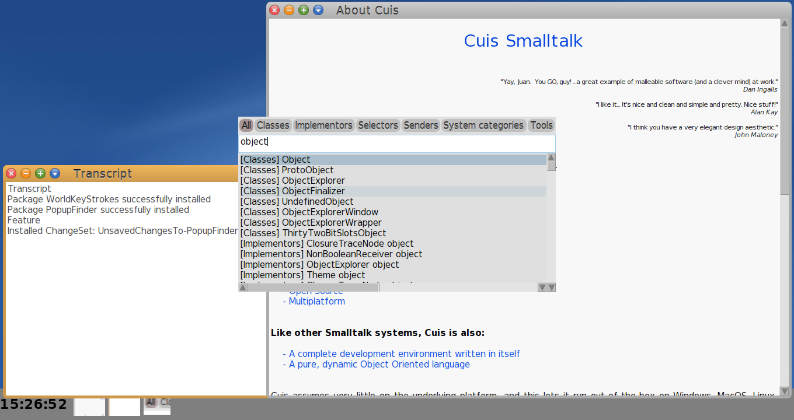

# PopupFinder

This is a variation of [Cuis Finder](https://github.com/npapagna/cuis-finder) by Nicolas Papagna, that uses a popup morph as user interface.

Finder is a system-wide search tool for [Cuis Smalltalk](https://cuis-smalltalk.github.io/Cuis-Website/).

You can use it to search for classes, methods, senders, implementors, system categories... you name it!

It is inspired by Pharo's Spotter and the search feature provided by JetBrains tools, such as IntelliJ IDEA.



# Install

Drag and drop PopupFinder.pck.st file into Cuis or: 

```Smalltalk
Feature require: 'PopupFinder'
```

# Usage

Use `shift + f` to open the finder.

`tab` or `left arrow` and `right arrow` keys to change category.

Also, you can use catalog specific shortcuts:

- `alt-c` : Classes catalog.
- `alt-n` : Senders catalog.
- `alt-m` : Implementors catalog.
- `alt-s` : Selectors catalog.
- `alt-p` : System categories catalog.
- `alt-t` : Tools catalog.


